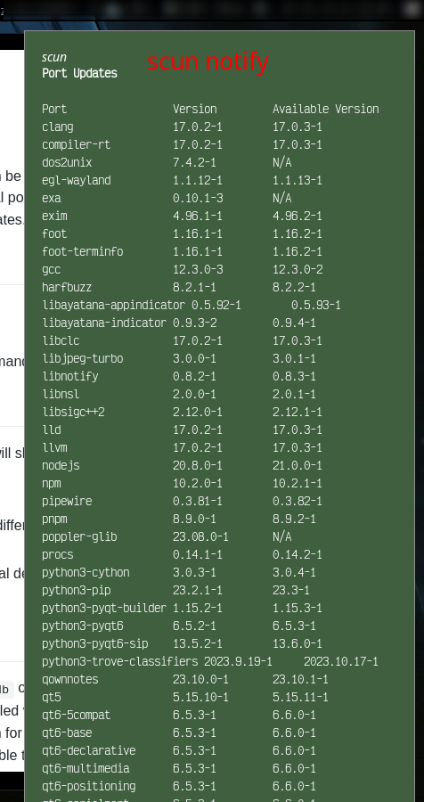

<div style="display: flex; justify-content: space-between;">
  <div>
    <h1>scun</h1>
  </div>
  <div>
    <p align="right">
      <a href="https://github.com/TimB87/scun/actions/workflows/ci.yml">
        
      </a>
      <a href="https://github.com/TimB87/scun/actions/workflows/clippy.yml">
        
      </a>
    </p>
  </div>
</div>

scun (simple CRUX update notifier) can be used on [CRUX](https://crux.nu) to figure out which ports are installed, check for available updates in your local ports tree and send a notification via libnotify.
It can also show the total number of available updates.
That's it, make your own sandwich!

## Principles

- be as minimal as possible
- don't depend on a lot of crates
- don't execute outside system commands to accomplish the job

## Usage

Running `scun` without any argument will show a short help message.

Available arguments:

- `print`: prints the total number of differences between installed versions and available versions
  - `--icon|-i` will prepend `󰚰` to the update number (requires a [nerd font](https://www.nerdfonts.com/))
  - `--long|-l` will print the list to the terminal
- `notify`: uses `libnotify` (external dependency) to display a notification that shows all available updates

## How

This program will read `/var/lib/pkg/db` on the system and extract the names of installed packages along with the currently installed version.
Then it will read `/etc/prt-get.conf` to figure out which directory it needs to search in for these ports.
It will construct a list of all installed ports which have some form of update available that you can display with either print or notify modes.

## Caveats

There is no intelligent logic in this code, no version comparator or anything.
This means that an installed port which can't be found in your tree will show up in this list (as `Available Update: "N/A"`) and even downgrades (for whatever reasons) will be displayed.

## Use case

This is developed to be used with [i3status-rust](https://github.com/greshake/i3status-rust) in a custom block configuration:

```toml
[[block]]
block = "custom"
command = "/usr/local/bin/scun print --icon"
interval = 60
[[block.click]]
button = "left"
cmd = "/usr/local/bin/scun notify"

```

## Screenshots




